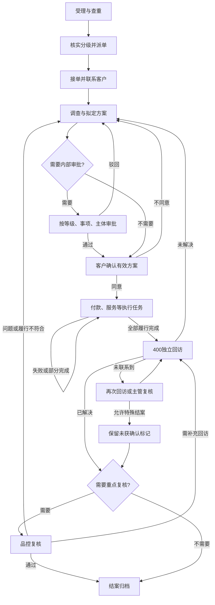

> 历史设计稿：页面结构、角色入口与客户确认方式，以 [产品结构重构方案](客诉工单系统_产品结构重构方案.md) 和 [当前原型说明](complaint-prototype/README.md) 为准。

# 客诉工单系统｜第一步：业务流程与角色操作确认表

版本：V0.1，流程评审稿。日期：2026-09-28。

本步交付：确定PC、内部移动H5、客户H5共同遵循的业务流程、角色动作、流转条件、通知入口和原型验收场景。本文中的入口仅说明业务落点，不代表页面布局已经设计。

依据：用户提供的整体设想及《客诉工单系统功能设计建议》。用户已明确要求PC与移动端共同跑通原型；此前提出的分级、计时、扣罚等优化建议尚未被逐项确认，本文统一标明“建议”或“演示暂定”，不视为正式制度。

## 1. 本步采用的工作方式

- 一张工单、一套状态和处理记录，在PC与H5共用。换设备、换角色不生成另一张工单。
- PC用于集中受理、团队管理和完整办理；内部H5用于员工接单、沟通、审批、财务登记、回访及督办。
- 内部H5有两个入口：钉钉通知直达指定工单任务；钉钉工作台进入个人待办后选择任务。
- 客户H5独立承担提交投诉、补充材料、确认方案、查询对外进度及评价，不开放内部备注、审批意见和员工管理操作。
- 后续原型模拟钉钉通知、身份切换、电话、付款结果和渠道接入。模拟行为必须可辨识；不向真实人员发消息、不产生真实付款。
- 本文不决定页面排版、视觉风格或技术框架。流程评审后再进入第二步“PC与H5页面范围及跳转关系”。

## 2. 角色和责任归属

| 角色 | 负责的事情 | PC操作范围 | 内部H5操作范围 |
| --- | --- | --- | --- |
| 400受理员 | 录入投诉、核实信息、查重、初分级、授权派单 | 建单、核实、派单、查询历史 | 代建单、补充信息、查询本人相关工单 |
| 门店店长 | 普通客诉办理、事实核实、门店服务履行 | 接单、沟通、方案、服务完成登记 | 同类单笔办理，优先移动端使用 |
| 区域经理 | 本区域协调、督办、接替安排 | 区域监控、协同、督办 | 风险查看、督办、协同反馈 |
| 售后专员 | 持续联系客户、组织方案、推进所有履行事项 | 完整处理、退款赔偿申请、交接 | 接单、联系记录、方案、申请、转派申请 |
| 售后主管 | 分级复核、兜底派单、授权审批、异常处置 | 全部授权工单、团队调度、规则配置 | 指派、审批、风险复核、督办、异常处理 |
| 管理层审批人 | 四级案件决策及超出常规授权的方案审批 | 授权案件决策与审批 | 通知直达审批、查看风险、提出意见 |
| 财务审核人 | 核对退款赔偿依据、金额、订单、支付主体 | 财务审核、驳回、核对历史付款 | 单笔审核、驳回、查看必要材料 |
| 财务付款人 | 按已批准方案执行并登记实际付款结果 | 待付款、结果登记、异常核对 | 单笔登记流水、上传凭证、记录失败 |
| 400回访员 | 独立核实履行和问题解决情况 | 回访队列、回访记录、退回处理 | 回访任务、联系记录、提交结果 |
| 品控/纪检 | 重点复核、责任认定、根因与整改验证 | 重点案件、抽检、整改、统计 | 重点复核、退回、整改验证 |
| 前端业务员 | 代客户提交与补充事实材料 | 代建单、查看本人提交进度 | 代建单、补材料、查看进度 |
| 客户 | 提交问题、提供材料、确认方案和反馈结果 | 不进入内部后台 | 使用独立客户H5 |

财务审核与付款作为两种职责建模，演示使用不同身份；真实人员是否兼岗由组织配置。申请人不审批本人申请。蒋琴、纪德庄等具体人员绑定岗位，不写死流程。

**总负责人**负责整单推进；**当前办理人**负责某个节点任务。一张工单可以同时有多个执行任务，每个任务各有明确办理人。

初次受理至接单前，由售后值班主管兜底；接单后，普通工单由店长、二级及以上通常由售后担任总负责人。转派申请未被接收前，原总负责人继续负责。审批、财务、回访节点变化不自动更换总负责人。

## 3. 状态与流转条件

### 3.1 工单主状态

| 状态 | 进入条件 | 可以流转到 | 必须保留的责任 |
| --- | --- | --- | --- |
| 待分配 | 正式提交受理；或未接单任务被收回 | 待接单、已撤回 | 值班主管负责找到承接人 |
| 待接单 | 指定承接人并生成接单任务 | 处理中、待分配、已撤回 | 承接人接单，主管监督 |
| 处理中 | 接单；或回访/复核要求继续处理 | 待回访、已撤回 | 总负责人推进各项任务 |
| 待回访 | 本轮约定事项全部履行且凭证齐全 | 已结案、处理中、已撤回 | 回访员办理；需品控时由品控复核 |
| 已结案 | 满足回访及必要品控条件 | 经授权重新打开至处理中 | 保留历史轮次及结案依据 |
| 已撤回 | 主管确认客户撤回，且遗留款项与风险已处理 | 经授权重新打开至处理中 | 保留撤回依据和历史行为 |

草稿不算正式工单，不计入受理量和正式时限。误建和重复录入使用“作废/并入”标记留痕并排除有效受理量，不伪装为“客户撤回”。

### 3.2 当前任务与主状态分开

“待首次联系、待补充材料、待方案审批、待客户确认、待财务付款、待补做服务”等是任务，不增加工单主状态。多个任务并行时，列表展示最近到期且未完成的任务，并可查看其余任务。

任务只有当前授权办理人可以提交结果；协同人可补充材料，抄送人按授权查看。提交动作须同时核对角色、任务归属、当前状态和方案版本。

已完成的任务保留结果。驳回、回访退回等产生新的任务轮次；旧任务不覆盖、不重新变成可提交状态。

## 4. 统一主流程

### 4.1 节点、角色、动作、必填内容和下一步

| 编号/节点 | 操作角色 | 操作与必填内容 | 状态或任务结果 | 下一办理人 |
| --- | --- | --- | --- | --- |
| N01 受理 | 400、员工代录、客户 | 提交可联系信息、问题描述、已知门店；记录来源及受理时间；客户未匹配或订单不明可标待核实 | 建正式工单：待分配；发现同一问题进行中则提示关联 | 400核实；主管兜底 |
| N02 核实与分级 | 400；主管复核高风险 | 确认客户、门店、分类、诉求、等级及判断依据；高风险线索先通知主管 | 更新信息；生成待派单任务；高风险复核可与联系并行 | 店长或售后；紧急案件主管指定 |
| N03 派单 | 系统规则、主管、授权400 | 指定人员；人工改派填写原因；校验在岗及可承接范围 | 待接单；生成接单任务 | 被指定承接人 |
| N04 接单 | 店长或售后 | 确认承接；无法承接需原因，不允许静默退回 | 处理中；确定总负责人；生成首次联系任务 | 总负责人 |
| N05 联系客户 | 总负责人 | 记录联系时间、方式、是否接通、核心诉求、沟通结果和下一动作；未接通必须设下次联系时间 | 接通则进入调查；未接通保留未联系成功并生成重试任务 | 总负责人；需要材料时客户或协同人 |
| N06 调查与拟定方案 | 总负责人、门店协同 | 事实材料、处理事项、金额/数量、执行人、承诺完成时间；形成方案版本；记录客户初步意向 | 需审批则生成审批任务；免审批则进入客户确认 | 授权审批人或总负责人 |
| N07 内部审批 | 主管、管理层、财务审核人 | 针对明确方案版本通过或驳回；驳回必填理由；金额和权限校验通过 | 通过后进入客户确认；驳回回到N06生成修订任务 | 总负责人 |
| N08 客户确认 | 客户；或总负责人记录电话确认依据 | 明确同意/不同意、确认时间、方案版本及确认材料；不同意记录原因 | 同意且必要审批完成后生成执行任务；不同意回N06 | 财务付款人、门店执行人等 |
| N09 执行方案 | 财务付款人、门店执行人 | 分别提交服务完成依据、实际付款金额、结果、时间及流水/凭证；失败记录原因 | 部分完成仍处理中；全部约定完成才进入待回访 | 400回访员；总负责人持续跟进 |
| N10 独立回访 | 400回访员 | 联系结果、履行是否完成、问题是否解决、满意度（获评分时）、反馈与依据 | 已解决进入结案判断；未解决回处理中；未接通安排重试 | 品控、总负责人或再次回访人员 |
| N11 重点复核 | 品控/纪检 | 按待确认的复核范围核对事实、履行、回访和结案材料；记录通过/退回及理由 | 通过可结案；履行不足回N06/N09；仅回访证据不足新建N10任务 | 系统结案或对应补办人员 |
| N12 结案 | 系统按结果归档 | 检查必要任务完成、付款无未决结果、回访及必要复核满足；保存结案原因和处理轮次 | 已结案；普通已解决与未获客户确认特殊结案分别标记 | 总负责人知会；需整改则继续整改任务 |
| N13 整改 | 门店/部门负责人、品控 | 根因、整改措施、责任人、期限；执行人提交证明，品控验证 | 整改单独待办、完成或退回；不覆盖客户工单结案记录 | 整改负责人或验证人 |

客户初步接受退款意向不等于最终同意已批准方案。N08必须对应当前有效版本；已批准方案的金额、主体、收款对象或服务内容发生实质变化，重新完成相应审批及客户确认。

紧急风险处置和首次联系可以先开展，不等待退款、赔偿方案审批；资金支付仍受相应审批控制。

### 4.2 每个节点的PC/H5入口、计时与通知

以下PC/H5内容是业务入口名称，第二步才决定合并为哪些页面。

| 节点 | PC入口 | 移动入口 | 时限起点/要求 | 触发通知 |
| --- | --- | --- | --- | --- |
| N01–N02 | 新建工单、客户/订单售后入口、待核实 | 内部H5代建单；客户H5投诉提交；主管高风险复核任务 | 以受理T0开始整单与首次联系计时；核实不顺延联系期限 | 受理回执给客户；风险线索通知主管 |
| N03 | 待分配、团队派单 | 主管H5待分配任务 | 受理T0起，使用T01派单规则 | 接单任务发给指定人员；无人承接通知主管 |
| N04 | 我的待接单 | 钉钉通知→该单接单任务；H5个人待办 | 派单成功起，使用T02接单规则 | 即将超时提醒；超时通知主管及重新分配 |
| N05 | 工单沟通记录 | 通知/待办→首次联系任务 | 首次联系从T0起，使用T03；重试另设明确日期时间 | 联系提醒发给总负责人；超时抄送主管 |
| N06 | 工单处理方案 | H5该单拟定/修改方案任务 | 按整单或阶段目标倒排；补材料任务必须有复查时间 | 协同材料通知相应人员；退回方案通知总负责人 |
| N07 | 我的审批、财务审核 | 通知→该单该版本审批任务 | 审批任务生成起计时；须早于方案履行目标 | 依次通知当前审批人；结果通知申请人 |
| N08 | 客户确认记录 | 客户H5方案确认；员工H5记录确认依据 | 发出有效方案后设跟进时间；不自动延长原承诺 | 客户方案通知；未响应提醒总负责人 |
| N09 | 待付款、服务执行记录 | 通知→具体付款/服务执行任务 | 执行条件满足且任务生成起；付款按T05，服务按约定时间 | 通知具体执行人；失败通知财务审核人及总负责人 |
| N10 | 回访队列 | 通知→回访任务 | 全部事项履行完成起，使用T06 | 通知回访员；未解决通知总负责人和主管 |
| N11 | 待品控复核 | 通知→重点复核任务 | 回访完成后任务生成起，使用T07 | 通知品控；退回通知具体补办人员 |
| N12 | 已结案工单、历史记录 | H5工单记录；客户H5对外进度 | 满足全部结案条件后记录时间 | 结案结果通知客户、总负责人及必要关注人 |
| N13 | 整改任务 | 通知→整改办理/验证任务 | 按整改事项单独指定截止时间 | 到期提醒整改人；超时通知其负责人及品控 |

## 5. 三条业务路径及审批路由

### 5.1 普通投诉

N01受理 → N02初分级 → N03派给店长 → N04接单 → N05联系 → N06拟定道歉/补做等方案 → 无须额外授权时跳过N07 → N08客户确认 → N09履行 → N10独立回访 → 按品控规则进入N11或N12。

如处理过程中新增退款、赔偿或发现安全风险，沿用原工单，在N06调整方案/等级并进入对应授权流程，不另建一张失去上下文的工单。

### 5.2 退款与赔偿

N01–N06由售后推进 → N07按下表审批 → N08确认已批准方案 → N09财务执行 → 与本方案其他事项一起判断是否全部完成 → N10回访 → N11/N12。

| 事项 | 演示采用的审批顺序 | 通过后执行人 | 说明 |
| --- | --- | --- | --- |
| 一级授权内的道歉/服务安排 | 无额外审批 | 店长或门店指定执行人 | 超出门店授权的服务或费用转主管审批 |
| 二级一般退款 | 财务审核人 | 对应支付主体财务付款人 | 沿用附件的财务审批思路；具体金额阈值待定 |
| 三级赔偿/复杂方案 | 售后主管 → 涉及资金时财务审核人 | 财务付款人及其他执行人 | 退款和赔偿分开核算；赔偿不是退款可退余额 |
| 四级重大方案 | 管理层审批人 → 涉及资金时财务审核人 | 指定财务付款人及其他执行人 | 售后主管组织处理并参与知会；紧急联系不等待方案审批 |
| 未找到适用主体或审批人 | 进入主管补充路由任务 | 补齐前不生成付款任务 | 不默认跳过审批 |

退款需核对关联订单、实付、已退、其他在途退款和本次可退金额；演示明确区分申请金额、审批金额、实际付款金额。支付主体以订单与实际收款关系核实，不直接用客户所属门店代替。

付款状态：待执行 → 已提交待确认 → 成功 / 失败 / 结果不明。部分付款逐笔记录；结果不明先核查，不能再次盲目付款。财务审核通过、上传一张凭证、提交银行操作，都不能单独代表客户已经到账。

### 5.3 重大投诉

发现风险 → 立即创建主管介入任务，同时由值班人员联系客户 → 主管复核等级并指定专人 → 专人持续调查、记录处置和下一次更新时间 → 重大方案审批 → 客户确认 → 履行 → 独立回访 → 品控重点复核 → 结案。

重大风险复核不改变原受理时间。风险等级与当前办理任务分开；三级/四级处理人可以与门店、专业部门协同，但整单仍只有一名总负责人。

紧急案件的“24小时”在本稿建议作为处置方案目标，不视为无条件结案期限。主管需明确阶段方案、更新频率和最终履行目标，禁止为了达标直接结案。

## 6. 异常分支操作表

| 编号/触发情况 | 谁处理 | 必须执行的操作/记录 | 状态与下一步 | 通知与两端落点 |
| --- | --- | --- | --- | --- |
| E01 同一问题多渠道进入 | 400或主管 | 展示候选单，核实客户、问题和时间；确认追加或独立建单；保留各渠道来源 | 追加原单不重置时间、不重复计单；不同问题独立建单 | 原负责人收到补充材料通知；PC/H5打开原单新记录 |
| E02 无匹配会员/订单/门店 | 400、总负责人 | 先受理，标待核实并安排核实人；款项事项执行前补齐订单和主体 | 工单继续联系处理；财务前置校验不通过则不付款 | 核实任务进入PC/H5待办 |
| E03 无人在岗或无人可接 | 值班主管 | 指定兜底人或自己承接；填写安排 | 留在待分配且可见，保留首次联系截止时间 | 主管钉钉通知及两端待分配任务 |
| E04 接单超时/拒绝承接 | 主管或派单规则 | 记录超时或拒绝原因；取消旧接单任务后重新派单 | 待接单→待分配→待接单；不重置受理时限 | 新承接人收到任务；原通知进入后显示任务已失效 |
| E05 联系未接通 | 当前联系人员 | 记录尝试次数、结果、下次联系时间 | 保持处理阶段；有效沟通仍未完成 | 下次联系任务发给该人员；达到规则次数通知主管 |
| E06 等待材料/申请暂停 | 总负责人申请、主管审批 | 暂停原因、相关任务、证据、恢复/复查时间；明确承诺期限是否另需协商 | 仅批准的内部任务暂停；自然历时保留；自动恢复或人工恢复 | 主管审批和到期复查均为PC/H5任务 |
| E07 请假/能力不符转派 | 原负责人申请、主管或接替人确认 | 原因、交接记录、接替人；接收后再变更负责人 | 主状态不重置；未接收前原负责人及主管承担责任 | 接替人H5交接任务；接收结果同步PC |
| E08 风险增加/申请升降级 | 办理人报告、主管复核 | 事实依据、原等级、新等级、审批依据；高风险降级需复核 | 保留原任务历史，补充或替换后续路由；既有付款不能重复生成 | 新决策人和主管收到风险任务；两端查看风险记录 |
| E09 审批驳回 | 审批人、申请人 | 驳回原因和补充要求；新方案版本重新提交 | 已驳回审批保留；回N06；总负责人不变 | 申请人PC/H5待修改方案 |
| E10 客户不同意方案 | 总负责人 | 分歧、客户诉求、下次联系时间；修改后重走必要审批和确认 | 保持处理中，回N06；不创建执行任务 | 总负责人收到跟进任务，重大分歧通知主管 |
| E11 付款失败/结果不明/部分成功 | 财务付款人、审核人 | 失败原因或核查记录；成功金额和未付余额；重试前核对原交易 | 保持处理中；只有未完成部分继续办理 | 财务核查/重试任务；通知总负责人，不发送已到账消息 |
| E12 回访确认未解决 | 回访员、总负责人 | 未解决事项、反馈和证据；增加处理轮次 | 待回访→处理中；回N06或N09；已付金额保留防重 | 总负责人及主管收到二次处理任务 |
| E13 回访低分但已解决 | 回访员、品控 | 分别记录已解决、真实低分及原因 | 按结案/品控规则继续，不自动创建复诉或扣罚 | 品控收到低分复核或整改任务 |
| E14 多次回访未联系到 | 回访员申请、主管复核 | 联系记录、履行证据、继续回访或特殊结案意见 | 继续N10；或标记未获客户确认后走必要N11/N12 | 主管两端复核；不填写虚构满意分 |
| E15 品控退回 | 品控、对应补办人 | 退回原因及缺失事项 | 问题/履行缺陷回处理中；仅回访材料不足保持待回访并新建回访任务 | 指定补办人的PC/H5待办，不丢给无明确责任的公共池 |
| E16 客户撤回 | 总负责人申请、主管审批 | 撤回依据、未完成承诺、在途资金/风险清单 | 未决事项先核清；通过后已撤回并取消未执行任务 | 审批及结果通知；客户进度显示撤回 |
| E17 结案后同一问题再次投诉 | 400核实、主管指定承接 | 原单、事实、再次反馈时间；区分原问题未解决与新事件 | 演示默认同一未解决事项重开原单，增加轮次；新事件建关联单 | 原负责人/新指定人及主管收到复诉任务 |
| E18 通知发送失败 | 系统重试、主管兜底 | 失败状态、重试记录；任务始终保留在待办 | 不改变工单业务状态，不把发送成功当作已接单 | PC/H5可主动进入待办；失败清单供主管处理 |
| E19 点击旧通知/已转派任务 | 系统校验、当前用户查看 | 读取最新状态和当前权限；提示已办理/已转交 | 有查看权则看最新进展，无操作权不出现提交动作 | 保留返回我的待办入口；不恢复旧任务 |
| E20 重复点击/两端同时提交 | 系统校验 | 识别同一任务和版本；第一次有效提交后返回最新结果 | 不重复审批、不重复建付款任务、不重复结案 | PC/H5刷新到一致状态，后提交者看到已处理结果 |

E06、E14、E17的具体业务口径见第10节，均为建议稿。任何重开或再处理都保留历史受理、结案、付款及回访时间。

结案后重开时，由主管确认新一轮总负责人并生成重新联系任务；本轮联系期限从再次受理时刻按当前等级计算。原始受理时间及上一轮时效结果保持不变，同时记录本轮开始、截止和结束时间。结案前回访退回则继续原案件处理，不借增加轮次清除已有超时记录。

## 7. 限时办理与超时督办

### 7.1 计时原则

T0为正式受理时间。外部渠道接入时分别保留原渠道受理时间和同步录入时间；原型使用正式提交时刻。首次联系从T0计时，派单、接单、转派不另起首次联系期限。

演示统一采用自然时间，便于在两端核对同一截止时刻；正式上线是否采用服务日历另行配置。原型可推进演示时间来触发预警，不需要真实等待数小时。

任务到期提醒与整单目标提醒分别计算，哪个先到就先提示。修改规则不静默改写进行中工单的既有承诺；需调整时记录原期限、新期限、原因和授权。

### 7.2 演示暂定参数（非业务已批准标准）

| 编号 | 事项 | 演示暂定值 | 起点及超时动作 |
| --- | --- | --- | --- |
| T01 | 分配 | 一级/二级15分钟，三级10分钟，四级5分钟 | 从T0起；超时由值班主管兜底；四级立即通知，5分钟是最晚指定目标 |
| T02 | 接单 | 一级/二级30分钟，三级15分钟，四级5分钟 | 派单后起；超时取消旧接单任务并重新分配，主管仍须保障首次联系 |
| T03 | 首次联系尝试 | 一级/二级2小时，三级1小时，四级30分钟 | 从T0起；未接通另建跟进任务；尝试与有效沟通分别统计 |
| T04 | 审批办理 | 每个审批任务4小时 | 任务生成起；若整单或阶段目标更早，则按更早时间督办；紧急案件可设更短期限 |
| T05 | 财务执行 | 24小时 | 审批、客户确认和付款资料齐备并生成执行任务后；超时通知财务负责人及总负责人 |
| T06 | 回访 | 24小时 | 全部承诺事项完成后；超时通知回访负责人 |
| T07 | 品控复核 | 24小时 | 复核任务生成后；超时通知品控负责人，不能自动默认通过 |
| T08 | 联系重试/特殊结案复核 | 演示3次，跨至少2个日期、不同时间段 | 达到次数只产生主管复核任务，不自动结案；特殊结案须经主管及品控复核 |

T01、T02的高风险短时限及T04、T07、T08为补充演示参数；T03和一般财务/回访时间参考附件。初始提醒采用耗时70%、90%、超时三个阶段。超时触发督办，是否改变等级另行复核。

整体目标不从上述节点简单相加。建议一级24小时完成履行，二级72小时完成履行；之后24小时回访，需品控时再设24小时复核。该建议相对附件“整体完结”的定义有变化，必须明确确认后才作为正式口径。三级演示以72小时形成可执行方案、四级24小时形成处置方案，最终履行日期在案件中单独确认。

若业务坚持二级72小时内连回访一并结案，就需要压缩方案、审批、执行和回访预算。不能一边串行分配48小时方案、24小时付款、24小时回访，一边显示总期限72小时且全部正常。

## 8. 钉钉通知、H5进入和两端同步

### 8.1 统一进入规则

任务生成 → 通知具体办理人 → 点击消息 → 识别员工身份及组织 → 检查该工单/任务权限 → 打开最新工单并定位任务 → 提交办理结果 → 更新状态、日志及下一待办 → 通知下一办理人。

从钉钉工作台进入则先看个人待办，再进入相同任务。办理人不需要先到PC查工单号。非钉钉环境需身份验证后才能访问内部工单；不因拿到链接而获得权限。

原型通过显式的演示身份模拟进入，不将角色切换按钮设计成正式产品的任意授权功能。身份识别和通知发送的真实接口由后续开发完成。

### 8.2 通知事件表

| 事件 | 接收人 | 消息要说清什么 | H5点击落点 | 办理后的变化 |
| --- | --- | --- | --- | --- |
| 新工单派给你 | 承接人 | 工单号、门店、脱敏摘要、等级、接单截止时间 | 指定工单的接单任务 | 接单完成，出现联系任务；PC同步 |
| 需要你补充材料 | 客户或协同员工 | 缺少什么、何时补充 | 客户H5补材料；员工内部H5协同任务 | 材料追加，通知总负责人 |
| 方案需要审批 | 当前审批人 | 事项、申请金额（按权限）、申请人、截止时间 | 指定版本的审批任务 | 通过进入下一审批/客户确认；驳回回申请人 |
| 方案需要客户确认 | 客户 | 可对外展示的方案、确认入口 | 客户H5方案确认 | 结果反馈总负责人；满足前置条件后生成执行任务 |
| 退款需要执行 | 对应主体财务付款人 | 工单号、付款事项、主体、金额、期限 | 该笔付款任务 | 记录实际结果；成功且其他事项完成才进入回访 |
| 服务需要履行 | 门店执行人 | 服务内容、约定时间、需提交的结果 | 该项服务执行任务 | 更新该项履行进度 |
| 需要回访 | 400回访员 | 已完成方案摘要、回访期限 | 该轮回访任务 | 已解决进入结案判断；未解决回总负责人 |
| 需要重点复核 | 品控 | 复核原因、结果摘要、截止时间 | 本轮品控复核任务 | 通过结案或退回指定办理人 |
| 即将超时/已超时 | 办理人及按规则抄送的上级 | 哪件事、截止时间、已超多久 | 对应任务；上级进入督办动作 | 催办留痕；不会替原办理人直接完成任务 |
| 高风险/再次投诉 | 主管、指定负责人 | 风险事实摘要、原工单关联、需采取的动作 | 风险复核/重新处理任务 | 指定负责人或调整处理方案 |

客户不接收内部钉钉工作通知，走客户渠道和客户H5。通知发送、消息已读、打开详情、接单、处理完成分别记录，不能互相替代。

后台待办是任务事实来源。通知失败不丢任务；旧通知不赋予旧权限。通知摘要尽量不包含完整手机号码、账户或敏感材料。

## 9. 原型验收脚本（后续必须实际跑通）

以下为未来原型验收要求，本步仅定义，并未执行页面测试。

| 场景 | 演示路径与角色/终端 | 验收结果 |
| --- | --- | --- |
| S01 普通投诉 | 400在PC建单→店长从模拟钉钉通知进入H5接单→H5记录联系与服务方案→客户H5确认→店长H5登记完成→400在PC回访→结案 | 两端同编号；状态、责任人、记录一致；无财务任务 |
| S02 一般退款 | 400在PC建单→售后H5接单并拟定退款方案→财务审核人H5审批→客户H5确认→财务付款人PC登记结果→400 H5回访→结案 | 审批前不能付款；仅付款提交不能回访；PC可追溯全流程 |
| S03 赔偿加补做 | 售后PC提交组合方案→主管H5审批→财务审核→客户确认→财务PC登记成功→店长H5完成服务→400回访→品控复核 | 两项执行均完成才生成回访；退款和赔偿分开核算 |
| S04 审批驳回 | 财务H5驳回→售后PC修改方案→重新审批→客户确认→执行 | 原审批保留，版本更新，旧确认不能批准新金额 |
| S05 无人接单及旧通知 | 系统派单→推进演示时间触发超时→主管H5改派→新人员接单→原人员点击旧通知 | 旧接单动作失效；不重置首次联系截止时间；没有两名总负责人 |
| S06 回访未解决 | 400 H5回访标记未解决→售后PC继续处理→再次履行→再次回访 | 轮次增加；原付款保留；不会重复退已退金额 |
| S07 重大投诉 | 员工H5提交风险线索→主管H5复核和指定→专人PC记录阶段方案→管理层H5审批→后续执行回访与品控 | 及时联系不等审批；必须重点复核；24小时方案目标不误显示为已结案 |
| S08 付款结果不明 | 财务PC登记已提交→H5记录结果不明→核查原交易→确认成功或失败 | 未核清前不允许重复付款，不向客户发送已到账 |
| S09 客户补材料与无法联系 | 客户H5补充→售后H5收到任务并记录联系未接通→重试→主管复核 | 补充材料不重复建单；未接通不计有效沟通；不自动满意结案 |
| S10 撤回、结案后再投诉 | H5登记撤回→主管核清遗留款项后批准；另以已结案单再次投诉重开 | 撤回与解决区分；旧历史保留；重开有依据和新轮次 |
| S11 两端同时办理 | 同一任务分别在PC/H5打开→一端完成→另一端提交 | 只产生一次有效结果；后提交者看到最新状态 |
| S12 权限与通知异常 | 模拟错误主体财务/其他门店身份访问→发送失败→已转派旧消息进入 | 无权者看不到敏感信息和办理动作；有权者从待办仍能处理 |

上述脚本同时覆盖主线、资金、重大风险、退回、转派、客户参与和跨端同步。不能仅凭按钮弹出“成功”提示判定流程跑通。

## 10. 尚需确认的业务口径

下列内容会影响流程结果，不能把建议默认当成公司制度。为了后续原型可以演示，每项给出建议采用的暂定值；调整时只修改对应规则，不推翻整套流程。

| 决策项 | 附件原想法 | 本稿建议/演示暂定 | 影响 |
| --- | --- | --- | --- |
| D01 退款工单72小时的终点 | 整体完结72小时；节点预算合计更长 | 72小时完成履行，24小时内回访；重点复核另设期限 | 决定整体倒计时和超时统计；若坚持72小时结案需重分预算 |
| D02 普通工单是否逐单终审 | 所有工单交品控最终确认 | 普通已解决工单回访后结案；三级/四级、二次处理及特殊结案必经品控，其余抽检 | 决定N11是否必经；若保留全量终审则所有分支进入N11 |
| D03 超时、复诉与扣罚 | 超时/重复投诉可自动升一级，重复投诉触发扣罚 | 超时自动督办，复诉优先复核；等级和绩效由事实与授权人员确认 | 决定自动化动作，避免时间问题直接改变投诉性质 |
| D04 审批额度、岗位与主体 | 二级财务，三级蒋琴，四级管理层；主体拆分 | 按第5节演示路由；具体金额阈值和岗位绑定尚待提供，不虚构实际授权金额 | 决定资金审批人及跨主体路由 |
| D05 回访未联系到 | 未明确 | 演示3次跨至少2日后由主管复核，特殊结案保留未获确认标记并经品控 | 决定无法联系场景去向和满意度分母 |
| D06 结案后复诉如何记单 | 关联重复投诉并升级 | 同一未解决事项重开原单增加轮次；新事件建关联单；登记独立复诉事件用于统计 | 决定工单数、复诉数和历史追溯 |
| D07 服务时间与紧急值班 | 有排班，但时限使用自然/工作时间未统一 | 原型统一自然时间；四级主管值班兜底 | 决定夜间和节假日的到期计算 |
| D08 客户确认方式 | 多渠道受理、电话协商 | 支持客户H5确认或员工记录电话确认依据；执行前确认必须对应已批准版本 | 决定客户端节点与证据要求 |

## 11. 本步交付与下一步交接

本步形成13个主节点、20个异常分支、10类通知事件、12条跨端验收脚本，以及8项明确标出的待确认口径。流程覆盖PC、内部H5、客户H5，移动端不是只读入口。

第二步以本稿节点为依据，整理“PC与H5页面清单及跳转关系”：把业务动作映射到页面，区分列表、详情、办理表单、结果反馈和权限/过期任务等异常状态。第二步完成前，不开始视觉布局和交互页面编码。

后续资料：[第二步：PC与H5页面清单及跳转关系](客诉工单系统_第二步_PC与H5页面清单及跳转关系.md)。
