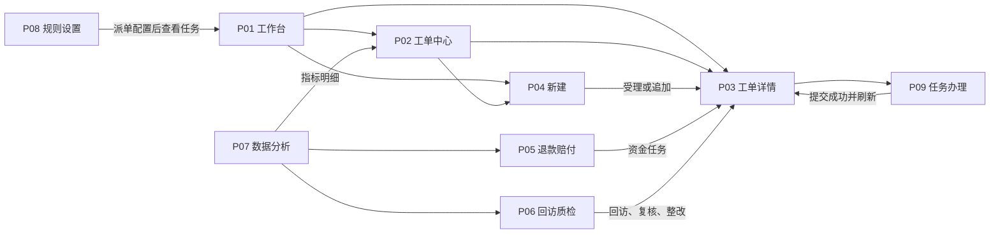
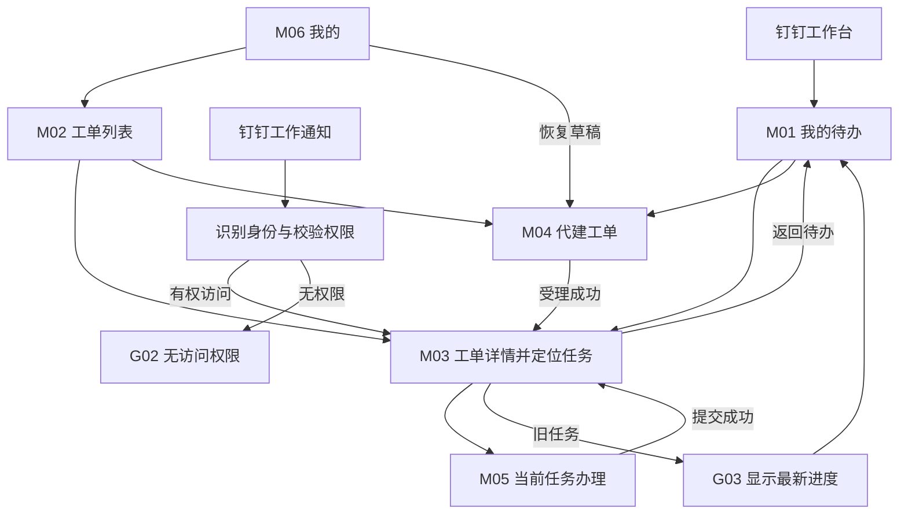
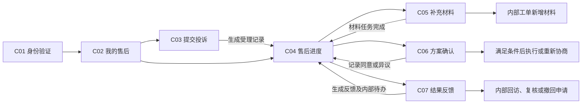

> 历史设计稿：页面结构、角色入口与客户确认方式，以 [产品结构重构方案](客诉工单系统_产品结构重构方案.md) 和 [当前原型说明](complaint-prototype/README.md) 为准。

# 客诉工单系统｜第二步：PC与H5页面清单及跳转关系

版本：V0.1，页面范围与交互关系稿。日期：2026-09-28。

依据：[第一步：业务流程与角色操作确认表](客诉工单系统_第一步_业务流程与角色操作确认表.md)。沿用其中N01–N13主节点、E01–E20异常分支、S01–S12验收场景。D01–D08业务口径仍为演示暂定，不因本步完成而视为正式确认。

本步确定页面职责、角色入口、主要操作、提交结果、返回路径和异常状态。页面编号用于后续制作及验收，不是对外展示的产品内容。本步未制作视觉页面，未修改 `zuhu.html`。

## 1. 总体页面范围

| 范围 | 页面模板 | 导航方式 | 负责什么 |
| --- | --- | --- | --- |
| PC后台 | P01–P09，共9类 | `zuhu.html`中新增“客诉管理”分组，下设6个菜单；详情、建单、办理不占一级菜单 | 受理、查询、办理、团队调度、财务、回访质检、统计和配置 |
| 员工移动H5 | M01–M06，共6类 | 底部“待办、工单、我的”；钉钉通知可直达工单详情 | 各岗位单笔办理和主管应急协调 |
| 客户H5 | C01–C07，共7类 | 售后入口、受理回执或客户进度链接进入 | 提交、补材料、确认方案、反馈结果和查询进度 |
| 共用办理表单 | F01–F14，共14类 | 嵌入PC的P09或H5的M05；接单等短操作可在详情内确认 | 同一业务动作的字段、校验和流转规则复用 |
| 共用反馈状态 | G01–G09，共9类 | 页面内提示或身份/异常状态承载，不增加业务菜单 | 身份、权限、旧任务、冲突、失败、空态、校验和成功反馈 |
| 原型演示工具 | X01，独立于正式产品 | 演示入口 | 选择示例身份、模拟通知、推进时间、载入与重置示例场景 |

22类业务页面模板按功能计数，不是22套彼此独立的数据或所有角色各复制一套。F类表单和G类状态嵌入对应页面，不叠加为新的一级页面。原型分批完成这些范围，每批都同时包含PC和H5的对应操作。

## 2. 导航与已有后台的衔接

### 2.1 PC菜单

```text
zuhu.html / 客诉管理
├─ 客诉工作台         P01
├─ 工单中心           P02
├─ 退款赔付           P05
├─ 回访质检           P06
├─ 数据分析           P07
└─ 规则设置           P08

从上述页面打开：工单详情 P03、新建工单 P04、任务办理 P09
```

沿用现有后台的菜单、顶部最近访问标签和列表/详情交互。工单详情进入独立业务标签，返回列表保留筛选、页码和滚动位置。任务办理通常在详情中打开抽屉；长方案可扩展为完整编辑区，业务结果不因展示容器变化而不同。

在现有客户详情增加“客诉记录/新建客诉”、订单详情增加“申请售后”、门店详情增加“本店客诉”。它们分别跳至带条件的P02或已预填关联信息的P04，复用既有客户、订单、门店资料。

现有“老客营销/门店回访”与本模块的“客诉回访”是不同任务，入口和统计分别呈现。账号、角色及组织范围复用现有管理入口，不在客诉模块再创建一套员工档案。

### 2.2 员工H5导航

```text
钉钉工作台 / 客诉处理 → 我的待办 M01
底部导航：待办 M01 ｜ 工单 M02 ｜ 我的 M06

钉钉工作通知 → 身份与权限检查 → 工单详情 M03（定位任务）
工单详情 M03 → 任务办理 M05 → 更新后的工单详情 M03
待办/工单列表右上入口 → 代建工单 M04
```

详情和办理页面提供返回，不重复铺设全部管理菜单。通知直接进入详情时，返回入口为“我的待办”，不依赖用户先打开过列表。主管的团队待办/未分配视图仍放在M01，所有数据受授权范围控制。

### 2.3 客户H5导航

```text
售后入口 → 身份验证 C01 → 我的售后 C02
我的售后 C02 → 提交投诉 C03 / 售后进度 C04
售后进度 C04 → 补充材料 C05 / 方案确认 C06 / 结果反馈 C07
客户通知链接 → 身份验证后恢复原目标 → 对应工单的C04/C05/C06/C07
```

员工内部链接与客户链接使用不同访问范围。客户只能进入本人售后记录；客服代录的信息不自动成为客户已确认事实。员工电话记录确认与客户在线确认分别标识来源。

## 3. PC页面清单

| 编号/页面 | 谁使用及入口 | 页面必须展示 | 主要操作 | 跳转与提交后落点 |
| --- | --- | --- | --- | --- |
| P01 客诉工作台 | 员工默认首页；主管有团队视图 | 适用于本角色的待办、接单/审批/回访等任务、具体截止时间、逾期；主管有未分配、高风险、负荷 | 打开任务、筛选队列、新建；主管指派/督办 | 任务→P03定位任务→P09；统计数字→带筛选的P02；新建→P04 |
| P02 工单中心 | 授权员工；菜单、客户/门店关联入口 | 待我处理、我创建、我关注、全部授权工单、历史；编号、客户、门店、摘要、等级、阶段、负责人、下一截止时间 | 搜索、筛选、查看、新建；授权批量派单/催办 | 查看→P03；新建→P04；派单→P09/F02；返回保留列表条件 |
| P03 工单详情 | 授权参与者；各业务队列、通知入口 | 统一摘要、当前任务、五类详情内容、方案版本、各项履行进度、全部轮次 | 按权限接单、联系、方案、审批、履行、回访、复核；更多动作含转派/风险/撤回 | 动作→P09相应表单；提交后回本详情刷新任务；关联订单/客户打开原后台详情 |
| P04 新建工单 | 400、授权代录员工 | 客户候选、已知门店/订单、来源、问题、诉求、材料、等级建议及相似工单提示 | 保存草稿、提交受理、确认追加已有单 | 新建成功→P03；追加成功→原单P03新记录；缺信息提示而非静默失败 |
| P05 退款赔付 | 财务审核/付款人、授权售后和主管 | 待审核、待付款、待确认结果、失败/结果不明、历史；主体、订单、可退金额、审批金额、实付/在途、凭证 | 审核、驳回、登记提交与结果、核查异常、查看原方案 | 选任务→P03定位资金事项→P09/F06或F08；返回资金队列保留筛选；退款申请在P03/F05发起 |
| P06 回访质检 | 400回访、品控、整改责任人、主管 | 待回访、待复核、整改任务及历史；显示处理轮次、方案履行证据、解决结果、评分和整改期限 | 回访、退回、复核、抽检、创建整改、提交/验证整改 | 选任务→P03对应记录→P09/F10、F11或F14；抽检也须生成可追溯任务 |
| P07 数据分析 | 主管、区域管理、品控 | 受理/未结案、联系与办理时长、超时、复诉、退款赔偿、门店/项目/根因；日期和指标口径 | 调整授权范围/日期、查看指标明细、授权导出 | 指标→P02相应筛选或P05/P06明细；保留可返回报表入口 |
| P08 规则设置 | 主管、管理员、授权配置人员 | 分类分级、时限督办、审批与主体、排班派单、通知、回访结案六组；关联岗位权限入口 | 编辑、校验、保存规则；安排替补、修改可接单状态 | 保存显示影响范围；在途截止/方案不静默重算；账号权限→既有账号/角色管理 |
| P09 任务办理 | 当前授权办理人；从P03当前任务进入 | 工单最小摘要、任务类型、办理人、截止时间、相关方案版本、对应F类表单、历史意见 | 草稿（适用长表单）、提交、明确的退回/拒绝；查看关联材料 | 成功关闭办理容器并刷新P03；保留“返回来源队列”；失败留在表单，保留输入 |

P05不另外建立一套退款案件，P06不复制工单；它们是同一工单不同任务的办理队列。财务不能因看见工单详情而编辑投诉原话，回访员不能修改已批准方案。

## 4. 员工H5页面清单

| 编号/页面 | 谁使用及入口 | 页面必须展示 | 主要操作 | 跳转与提交后落点 |
| --- | --- | --- | --- | --- |
| M01 我的待办 | 钉钉工作台首页；所有员工按职责显示，主管有团队视图 | 待接单、待联系、待审批、待执行、待回访等适用分类；任务、工单摘要、期限；未分配和风险按权限出现 | 筛选、打开任务、代建单；主管打开派单/督办任务 | 任务→M03定位任务；代建→M04；办理完成后待办数量同步 |
| M02 工单列表 | 底部“工单”；员工与主管 | 本人负责/创建/关注及授权范围工单，包含已结案历史；检索与必要筛选 | 查找、查看、代建；授权主管查看团队案件 | 工单→M03；代建→M04；返回保留筛选和位置 |
| M03 工单详情 | 通知直达、M01任务、M02列表 | 工单摘要、当前任务、总负责人、当前办理人、截止时间、问题/记录/方案/回访整改/流转；按角色过滤敏感内容 | 展示当前可办动作；接单等短操作确认；联系、方案、审批、财务、回访等进入M05 | 办理→M05；成功后回本详情；从通知进入可回M01；已失效任务按G03展示 |
| M04 代建工单 | 400或员工，从M01/M02进入 | 已知客户/门店/订单、来源、问题、诉求、材料；可保存草稿 | 匹配客户、录入、上传、受理、内部查重确认 | 受理→M03；追加→已有工单M03；无权查看相似单时仅交400核实 |
| M05 任务办理 | 店长、售后、审批人、财务、回访、品控；从M03进入 | 当前任务和F类表单；必要证据；相关金额/主体/方案版本按任务显示 | 填写、上传、同意/驳回、提交结果等具体任务动作 | 成功→M03刷新；失败保留输入；返回未保存时提示保存草稿或放弃 |
| M06 我的 | 底部“我的”；内部员工 | 当前员工及岗位、所属组织、可查看范围、我的发起/历史/草稿入口；自身可接单状态 | 查看本人相关记录，恢复草稿；按授权设置暂停接新单或发起交接 | 发起/历史→M02带筛选；草稿→M04/M05；交接→M03的F02任务 |

“我的”不提供任意切换他人身份的正式功能，演示身份切换放在X01。暂停接新单不取消正在处理的工单，已有任务需要交接确认。

移动端提供完整的单笔处理能力，包括财务审核、付款记录、回访和品控。复杂统计、批量管理、规则配置集中在PC；H5遇到尚未配置的审批人时明确进入主管待办，不要求员工临时自行补后台规则。

## 5. 客户H5页面清单

| 编号/页面 | 入口与身份 | 展示与操作 | 完成后的去向及限制 |
| --- | --- | --- | --- |
| C01 身份验证/恢复访问 | 售后入口或客户通知；验证本人身份 | 验证后建立客户访问身份；保留原目标；原型模拟验证并明确示例身份 | 回原目标C02–C07；验证失败留本页；不通过单凭链接查看他人工单 |
| C02 我的售后 | 验证后的默认入口 | 本人申请摘要、门店、对外进度、待本人补充/确认事项；提交新投诉 | 记录→C04；新投诉→C03；不显示内部等级、责任认定和员工队列 |
| C03 提交投诉 | C02或售后入口 | 门店/订单候选、问题描述、诉求、联系方式、附件；订单不明可先提交 | 成功→C04显示受理编号；疑似重复可提示本人相关记录，不暴露其他客户或内部查重数据 |
| C04 售后进度 | 客户回执/进度通知、C02 | 已受理、沟通处理、方案待确认、执行进度、结果及回访；对外方案和材料 | 按需进入C05/C06/C07；“申请撤回/再次反馈”进入C07相应模式，经内部处理后才改变工单状态 |
| C05 补充材料 | 补材料通知、C04 | 本次需要什么、截止/建议时间、补充说明和图片/视频等允许附件；已交材料 | 提交→C04，追加材料并通知负责人；材料上传失败时不显示提交完成 |
| C06 方案确认 | 已批准有效方案的客户通知、C04 | 本次方案版本、退款/赔偿/服务事项、金额、执行安排；同意或提出异议 | 同意→C04并满足相应确认条件；不同意必填意见，生成负责人任务；旧版本不可继续确认 |
| C07 结果反馈 | C04、评价/反馈通知 | 评价模式：是否解决、满意度和意见；再次反馈模式：未解决/新问题描述与材料；撤回模式：撤回原因 | 提交→C04；客户评分不替代400独立回访；撤回须主管处理；新诉求交内部核实，不自动结案或扣罚 |

对外进度采用客户能够理解的表达。内部审批人、督办批评、责任扣罚、其他客户信息、内部账户资料不出现在C类页面。已有款项仅依据实际确认状态展示，付款提交不显示“已到账”。

## 6. 工单详情与任务办理的统一结构

### 6.1 PC与员工H5共用的信息顺序

1. 工单摘要：编号、等级、主状态、客户/门店、总负责人、当前办理人、下一期限。
2. 当前任务：本次要做什么、由谁做、何时完成、所需材料及可执行动作；多任务并行可展开任务列表。
3. 问题与客户：原始诉求、订单、来源、附件、风险事实。
4. 处理记录：联系结果、沟通记录、补充材料、下一次跟进。
5. 处理方案：版本、内部审批、客户确认、每项执行结果和付款记录。
6. 回访与整改：各轮回访、品控意见、整改任务和验证结果。
7. 流转记录：派单、交接、调整、暂停恢复、驳回、结案与重开等时间线。

PC可用详情页签组织，H5按当前任务优先呈现，其他内容按分组查看。完整信息共用；不会给每种岗位复制一份内容可能不同步的工单详情。

### 6.2 共用办理表单及提交结果

所有表单在P09或M05承载；F03短确认可直接在P03/M03完成。每次提交必须产生记录、更新当前任务并明确下一步，不能只出现“操作成功”提示。

| 编号/办理表单 | 使用角色与流程 | 必须填写/核对 | 主要动作及结果 |
| --- | --- | --- | --- |
| F01 核实与查重 | 400/主管；N01–N02、E01–E02 | 身份匹配、门店/订单、分类诉求、等级依据、相似单关联；不能匹配的原因 | 确认信息→进入派单；确认追加→原单新增记录并保留来源；新问题独立建单 |
| F02 派单与交接 | 主管、授权400、当前负责人、接替人；N03、E03–E04、E07 | 承接范围、在岗/负荷、指定人、原因、交接内容；操作模式由身份决定 | 初派/改派→新接单任务；申请交接→接替人确认任务；确认后才改总负责人 |
| F03 接单确认 | 指定承接人；N04 | 工单摘要、办理期限、承接确认；拒绝承接时原因 | 接单→处理中和联系任务；拒绝→主管重新安排；旧接单任务不可再办 |
| F04 联系与沟通 | 总负责人/授权协同；N05、E05 | 时间、方式、接通结果、诉求、沟通内容、下次行动/时间 | 接通→完成相应联系任务并继续调查；未接通→联系重试任务；额外备注不自动完成首次联系 |
| F05 处理方案 | 总负责人；N06、E09–E10、E12 | 本轮事实、方案版本、事项清单、退款/赔偿/服务明细、执行人、期限、客户初步意向 | 提交审批→当前审批人任务；免审批→客户确认；修改生成新版本并重新校验必要审批 |
| F06 审批与异常审批 | 授权主管/管理层/财务；N07、E06、E09、E14、E16 | 对应申请类型、事实及证据、版本/主体/金额（资金时）、通过/驳回意见 | 方案通过→下一审批或客户确认；驳回→申请人补充；暂停/撤回/特殊结案按对应条件改变任务 |
| F07 记录客户确认 | 总负责人；N08 | 已批准版本、联系时间、同意/异议、证据来源及材料 | 同意且审批齐备→生成执行任务；异议→修改方案任务；与C06在线确认共用一个确认结果 |
| F08 资金执行与核对 | 财务付款人/授权核查人；N09、E11 | 已批方案、客户确认、支付主体、可执行金额、在途/已付、实际结果、流水凭证 | 登记提交→待确认；成功→更新该笔履行；失败/结果不明→核查任务，不能再次盲目付款 |
| F09 服务履行与协同材料 | 门店执行人/协同人；N06/N09 | 指定事项、执行时间、结果和凭证；材料任务填所需事实资料 | 服务完成→更新该项履行；仅上传协同材料不标记服务完成；最后一项履行完成→回访任务 |
| F10 回访记录 | 400回访员；N10、E12–E14 | 联系结果、是否履行、是否解决、评分（获得时）、客户意见、证据、需继续跟进内容 | 已解决→品控或结案判断；未解决→二次处理任务；未联系到→重试或申请特殊结案复核 |
| F11 品控复核 | 品控；N11、E15 | 复核原因、当前处理轮次、方案和履行、回访依据、结论与退回原因 | 通过→结案判断；退回问题处理/执行/回访→对应人员新任务；整改可另建F14 |
| F12 风险复核与督办 | 办理人报告、主管复核、授权管理人员；E08 | 风险事实、建议等级/复核结论、理由、需介入人员；督办事项与要求 | 风险报告→主管复核任务；复核→调整后续路由；催办→留记录并提醒，不替原办理人完成任务 |
| F13 暂停/撤回/重开申请 | 总负责人或授权受理人；E06、E16–E17 | 类型、理由、依据、相关任务、恢复时间或未决款项；重开需关联原轮次与新诉求 | 暂停/撤回申请→F06审批；复诉核实→主管确认负责人后重开/关联新单；批准前保持既有责任 |
| F14 整改与验证 | 品控、责任部门、整改人；N13 | 根因、整改措施、责任人、期限；执行证明、验证意见 | 创建→责任人待办；提交→品控验证；退回继续整改；完成仅关闭整改任务 |

资金审批、付款登记、客户确认、回访、结案是不同业务动作。前一动作成功不能代替后一动作的证据。

## 7. 页面跳转关系

### 7.1 PC主关系



### 7.2 员工H5与钉钉通知



G01身份过程保留原工单和任务目标；完成后恢复目标。通知中只有定位信息，实际内容和操作权限每次以当前工单为准。查阅历史可以允许，旧动作不可恢复。

### 7.3 客户与内部流程衔接



## 8. 通知点击与任务落点

PC点击同类消息进入P03定位任务，再打开P09；员工手机进入M03定位任务，再打开M05。审批通知先展示工单及方案依据，不直接提交审批。客户消息使用C类页面。

| 通知类型 | 接收角色 | 手机点击落点 | 对应办理 | 完成后的下一步 |
| --- | --- | --- | --- | --- |
| 待接单/超时改派 | 店长、售后、指定承接人 | M03当前接单任务 | F03 | 新增联系任务，P01/M01同步 |
| 待联系/补充沟通 | 总负责人 | M03联系任务 | M05/F04 | 调查方案或下次联系任务 |
| 门店补材料/服务执行 | 协同人、服务执行人 | M03对应子任务 | M05/F09 | 资料追加或该项履行更新 |
| 待方案/财务审批 | 当前授权审批人 | M03指定方案版本与审批任务 | M05/F06 | 下一审批、客户确认或退回修改 |
| 待付款/付款异常 | 对应主体财务付款或核查人 | M03指定资金任务 | M05/F08 | 更新实际结果或继续核查 |
| 待回访 | 400回访员 | M03本轮回访任务 | M05/F10 | 结案判断、重点复核或二次处理 |
| 待品控复核/整改验证 | 品控 | M03复核或整改任务 | M05/F11或F14 | 结案、补办或整改完成 |
| 转派接替确认 | 指定接替人 | M03交接任务 | M05/F02 | 接收后变更负责人，原时限保留 |
| 高风险/超时督办 | 主管、区域管理、指定负责人 | M03风险或逾期任务 | M05/F12；必要时F02 | 复核、指定、督办；原办理责任不消失 |
| 暂停/撤回/特殊结案审批 | 主管、必要时品控 | M03相应申请 | M05/F06或F11 | 按审批类型决定暂停、继续或进入结案判断 |
| 客户补材料/确认方案/反馈 | 客户 | 验证后C05/C06/C07 | 客户对应操作 | C04更新；内部生成相应任务或材料记录 |

提交成功反馈要说明“本次完成什么、下一步由谁做”。员工不自动跳入下一位办理人的表单，也不自动取得下一角色权限。演示需要下一角色时由X01显式切换。

## 9. 共用反馈状态与返回规则

| 编号/状态 | 页面表现与操作 | 数据与流转要求 |
| --- | --- | --- |
| G01 身份识别中/需验证 | 显示正在识别或要求验证；失败可重试；成功回原目标 | 未识别前不显示工单敏感内容；不丢目标工单/任务；客户与员工分别验证 |
| G02 无权限/无可访问记录 | 明确无权访问，提供返回我的待办/我的售后；不显示内部详情 | 不根据链接授予权限；无权和不存在的记录不泄露客户信息 |
| G03 任务已处理/已转派/旧通知 | 显示任务失效原因与可见的最新进展，移除旧提交动作 | 有查看权可继续看原单，无查看权回G02；返回列表仍可用 |
| G04 状态或版本已变更 | 提示方案/任务已更新，查看最新版本；保留本地未提交内容供核对 | 不把旧意见自动提交到新版本；客户旧方案确认无效 |
| G05 加载或提交失败/结果待核实 | 加载失败可重试；提交失败保留输入；结果未知先查询已提交结果 | 禁止失败时清空表单；结果不明不盲目重发资金、审批或结案动作 |
| G06 无待办/筛选无结果 | 区分“当前无任务”和“筛选无结果”，提供清除筛选或按权限新建 | 不用虚构任务填充；指标计数与列表一致 |
| G07 附件处理中/失败 | 显示上传进度、失败原因、重试/移除；必需凭证未完成时不能提交 | 不把上传中附件视为成功凭证；恢复上传不重复生成沟通记录 |
| G08 必填/额度/条件校验失败 | 定位字段并解释缺少的事实或不满足的条件 | 审批、确认、可退余额、主体和任务权限不满足时不流转；表单输入保留 |
| G09 提交成功 | 展示本次结果和下一处理人/事项；提供查看工单/返回待办 | 工单、任务、日志、通知队列一起更新；重复点击只产生一次有效结果 |

所有长表单离开前处理未保存输入。创建草稿不启动正式时限；已受理工单上的表单草稿不暂停任务时限。打开详情、拨打电话按钮和阅读消息不自动完成业务任务。

## 10. 流程到页面的覆盖核对

### 10.1 主节点

| 第一步节点 | PC承载 | 员工H5承载 | 客户H5参与 |
| --- | --- | --- | --- |
| N01 受理 | P04；P09/F01处理查重 | M04；M05/F01 | C03提交，C04受理结果 |
| N02 核实分级 | P03→P09/F01、F12 | M03→M05/F01、F12 | C05按需提供资料 |
| N03 派单 | P01/P02→P03→P09/F02 | M01→M03→M05/F02 | C04展示对外进度 |
| N04 接单 | P03/F03 | M03/F03 | 无内部接单操作 |
| N05 联系 | P03→P09/F04 | M03→M05/F04 | C05补材料 |
| N06 方案 | P03→P09/F05、F09 | M03→M05/F05、F09 | C05提供所需材料 |
| N07 审批 | P01/P05→P03→P09/F06 | M01/通知→M03→M05/F06 | 不开放内部审批 |
| N08 客户确认 | P03→P09/F07记录电话确认 | M03→M05/F07 | C06本人在线确认 |
| N09 执行 | P05/P03→P09/F08、F09 | M03→M05/F08、F09 | C04查看执行进度 |
| N10 回访 | P06→P03→P09/F10 | M03→M05/F10 | C07反馈不替代独立回访 |
| N11 品控 | P06→P03→P09/F11 | M03→M05/F11 | C04仅展示对外结果 |
| N12 结案 | P03最新状态、P02历史 | M03结果、M02历史 | C04结果及C07再次反馈 |
| N13 整改 | P06→P03→P09/F14 | M01→M03→M05/F14 | 不展示内部责任整改详情 |

### 10.2 异常分支

| 第一步异常 | 必须出现的入口/状态 |
| --- | --- |
| E01 多渠道查重、E02 信息不全 | P04/M04的查重与待核实；P09/M05的F01；C03仅展示本人可见结果 |
| E03 无人可接、E04 接单超时 | P01/M01主管未分配；F02重新分配；原通知G03 |
| E05 未接通 | F04或F10记录结果、生成下次任务；M01/P01待办 |
| E06 暂停恢复 | P03/M03更多动作→F13申请→F06审批；到期复查/恢复任务进入P01/M01，授权办理人用F13恢复并记录依据 |
| E07 请假转派 | M06交接入口或P03/M03更多动作→F02；接替人收到确认任务 |
| E08 风险变化 | P03/M03报告/复核→F12，调整后续任务 |
| E09 审批驳回、E10 客户异议 | F06或C06/F07提交意见→总负责人F05修订，旧版G04 |
| E11 付款异常 | P05异常队列、M01财务任务→F08；结果待核实G05 |
| E12 未解决、E13 低分、E14 未联系到 | F10分别记录；未解决回F05/F09，低分进入品控/整改，未联系到安排重试或F06特殊结案审批 |
| E15 品控退回 | F11选具体补办事项→对应F04/F05/F08/F09/F10任务 |
| E16 撤回 | C07提交意愿或内部F13申请→F06审核；C04/P03/M03显示结果 |
| E17 结案后再反馈 | C07或P04/M04关联原单→F01核实、F13发起重开→主管F06确认承接人或F02指派→新轮次任务 |
| E18 通知失败 | X01模拟失败；P08通知记录查看失败与重试；P01/M01原任务仍在 |
| E19 旧通知、E20 重复/并发提交 | G03/G04/G05/G09；有权查看最新结果，无权操作不得提交 |

## 11. 原型演示控制与数据关系

X01属于验收工具，不占正式产品菜单。包含示例人员与当前身份、PC/员工H5/客户H5入口、模拟通知收件箱、演示时间推进、S01–S12场景载入及单次确认后的示例数据重置。

模拟通知按当前身份展示，点击走真实原型跳转规则；不发送真实消息。角色切换只改变演示身份，不偷偷代替其他人审批。切换回PC或H5看到同一工单最新状态。

原型需要共用：工单、任务及负责人、方案版本、客户确认、付款/服务执行、回访轮次、品控与整改、通知记录、操作日志和演示时钟。跨端入口通过工单标识与任务标识关联；相关标识只用于定位，不作为授权依据。

原型演示要求同一运行环境中PC视图与H5视图共享数据；真实两台设备实时同步属于后续服务端接入，不把手机外观预览宣称为已完成真实钉钉集成。

示例数据至少有：普通服务单、一般退款单、赔偿加服务组合单、重大风险单、审批驳回单、付款结果不明单、回访退回单、已结案后复诉单，以及无权限/旧任务场景。显示为示例数据，不混入现有客户真实记录。

## 12. 验收场景的页面路径

| 第一步场景 | 后续原型必须能够实际点击的路径 |
| --- | --- |
| S01 普通投诉 | P04→P03派单→X01店长通知→M03/F03接单→M05/F04联系→F05方案→C06确认→M05/F09服务完成→P06/F10回访→P03结案 |
| S02 一般退款 | P04→M03接单→M05/F05→X01财务通知→M05/F06→C06→P05/F08结果登记→M05/F10→P03/C04结果 |
| S03 赔偿加补做 | P03/F05→主管M05/F06→财务F06→C06→P05/F08与店长M05/F09分别完成→F10→F11→结案 |
| S04 审批驳回 | M05/F06驳回→P01申请人待办→P03/F05新版本→F06重审→C06有效版本确认；旧C06显示G04 |
| S05 无人接单与旧通知 | X01推进时间→主管M01/F02改派→新承接人M03/F03→原通知M03/G03 |
| S06 回访未解决 | M05/F10未解决→P01总负责人待办→P03/F05或F09→再次回访→保留原付款与各轮记录 |
| S07 重大投诉 | M04→主管M01/F12及F02→P03/F05→管理层M05/F06→执行、回访、F11重点复核 |
| S08 付款结果不明 | P05/F08登记提交→M05/F08结果不明→核查任务→F08确认结果；不得直接出现再次付款成功 |
| S09 补材料与无法联系 | C05→M01协同/跟进→M05/F04未接通→下次待办；回访未联系到时F10→主管F06复核 |
| S10 撤回与复诉 | C07撤回意愿→内部F13/F06→C04撤回结果；另以结案单C07再次反馈→F01/F13/F06或F02→新轮次M03 |
| S11 两端同时办理 | 同一任务P09与M05分别打开→一端有效提交→另一端G03/G04显示最新状态 |
| S12 权限与通知异常 | X01错误身份/发送失败→G02；切回有权身份P01/M01找到原待办；旧通知G03 |

此表是验收要求，当前并未创建或测试可点击原型。下一步制作时，每条路径须验证状态、任务数量、资金记录和操作日志，而不只检查页面是否打开。

## 13. 第三步制作顺序

按完整业务路径分批制作，每批同时做PC和H5所需部分，不先堆满全部PC页面。

| 批次 | 制作范围 | 完成判断 |
| --- | --- | --- |
| A 普通投诉主线 | 最小X01；P01–P04及P09；M01–M06相关功能；C01–C07基础提交/确认/进度；F01–F05、F07、F09–F10，P06回访队列，必要G状态 | S01可从PC建单，经H5接单处理、客户确认、400回访完成结案；两端状态一致 |
| B 退款赔偿 | P05；F06/F08；方案版本、财务身份、付款结果、组合执行、P06重点复核及F11 | S02–S04、S08可跑通，资金任务不重复，组合方案未全部完成不能回访 |
| C 风险与异常 | F02交接、F12–F14；主管、品控和整改任务；补齐暂停、撤回、重开、通知失败、并发和权限状态 | S05–S07、S09–S12全部跑通 |
| D 管理与整体校对 | P07/P08、团队统计、规则编辑与排班、其余角色入口与返回路径 | 数据能追溯到工单，规则影响明确，全部S场景回归通过 |

本步完成的是页面范围与跳转设计。下一步从A批开始制作可操作原型；第一条验收主线为“PC受理→钉钉通知模拟→H5接单处理→客户确认→服务履行→400回访→结案”。

### 第三步进展（2026-09-28）

A批普通投诉主线已制作并通过浏览器实际操作跑通，PC与员工/客户H5共用工单数据，`zuhu.html` 已增加客诉管理入口。演示方法、17项规则检查结果及本批边界见 [A批原型说明](complaint-prototype/README.md)。B/C/D批仍按上表逐步推进；此前“当前并未创建或测试”的描述为第二步交付时的状态。

P08规则配置现已改为场景列表，每行进入基本信息、审批流程和处理规则配置；配置保存后对新工单生效。B1已将退款审批配置接入实际原型任务，赔偿审批仍待B2；工作日历及按时段排班仍在D批。旧工单保留受理时规则，不随配置保存静默重算。

B1一般退款已实现：P05财务处理、PC/员工H5审批与退款结果办理、客户H5有效版本确认、订单可退金额与独立资金记录。包含审批驳回、客户异议、撤回修订、失败重试及待核实禁止重复执行。49项业务/配置检查通过；浏览器已验证新建退款单送审，以及H5主管/财务审批、客户方案展示；客户提交确认至财务结果、回访结案的实际点击仍待补验。详见 [当前原型说明](complaint-prototype/README.md)。下一批为B2赔偿与组合履行。
