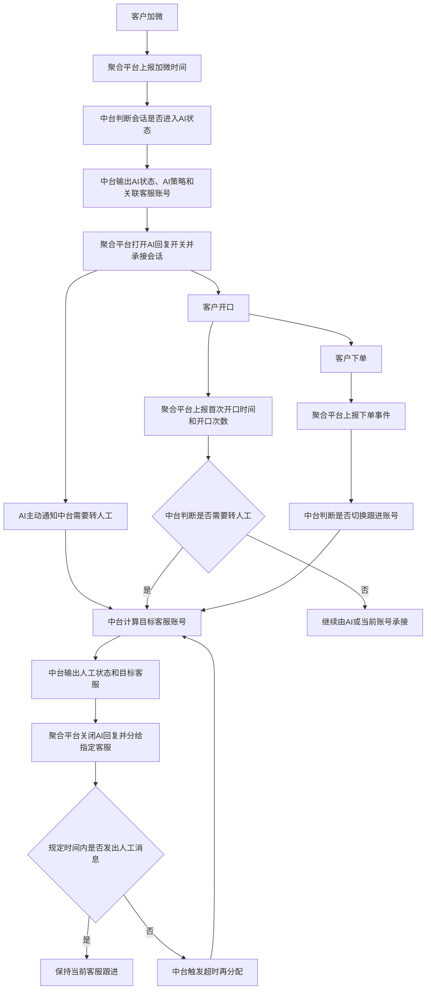
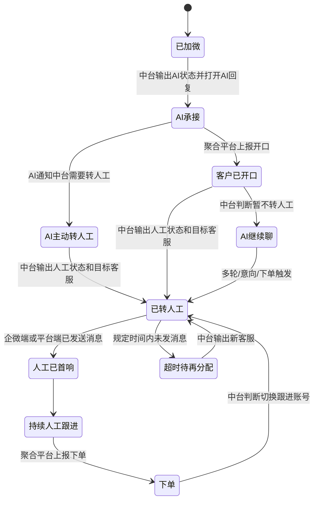

# 聚合客服平台与中台转接规则逻辑说明

本文档说明“转接规则”的业务边界和流程逻辑，用于中台与聚合客服平台研发对齐。本文不定义具体接口、参数和代码实现。

## 1. 核心结论

聚合客服平台负责上报事实和执行结果，中台负责判断策略和输出归属。

中台最终需要回答两个问题：

> 某个事件触发后，这个企微下的这个客户会话，当前聊天状态应该是 AI 还是人工？如果是 AI，用哪个 AI 策略聊；如果是人工，由哪个客服账号跟进？

答案只有两类：

- 转 AI：聚合平台将该客户会话状态切到 AI，并打开 AI 回复开关；同时调用指定 AI 策略、使用指定 AI 身份聊天，并关联后续客服账号。
- 转人工：聚合平台将该客户会话状态切到人工，并关闭或停止 AI 自动回复；同时把会话分给中台指定的客服账号。

聚合客服平台不判断客户当前应该是 AI 状态还是人工状态，也不判断客户应该分给谁。客服组、加微包最终都由中台算出具体客服账号，再给聚合平台执行。

也就是说，聚合平台最终接收的是“聊天状态 + 当前承接对象”：当前是 AI 就打开 AI 回复开关，当前是人工就标记为人工并关闭 AI 自动回复。

AI 在聊天过程中如果判断需要转人工，只需要通知中台“这个会话要转人工”。中台可以记录 AI 给出的原因，但转接规则页面不配置原因、不配置判断条件，只配置收到该信号后应该分给谁。

## 2. 业务背景

聚合客服平台聚合多个企业微信主体、多个企微号的聊天会话。客户虽然加在不同企微号下，但客服归属不再按“客户加了哪个企微号”固定。

新的分配方式是按“会话客户”统一分配。

这里要特别明确：客户加在哪个企微号，只代表消息通道，不代表最终客服归属。最终归属由中台按会话重新分配。

例如：两个企微号加了 100 个客户，其中 50 个客户开口。聚合平台把这 50 个会话的关键事件上报给中台，中台按转接规则、AI 策略、客服账号、加微包、超时规则等，决定每个会话下一步给谁跟进。

## 3. 双方职责

| 平台 | 负责 | 不负责 |
|---|---|---|
| 中台 | 判断规则、控制会话聊天状态、输出会话归属、记录开口次数/转人工时间/超时与再分配 | 不直接收发企微消息，不操作聚合客服页面 |
| 聚合客服平台 | 消息收发、会话展示、事件上报、执行中台结果 | 不判断当前应为 AI 还是人工，不判断最终分配对象 |

## 4. 中台输出

### 4.1 转 AI

当会话应由 AI 承接时，中台输出：

| 输出内容 | 说明 |
|---|---|
| 会话客户 | 哪个企微下的哪个客户会话 |
| 聊天状态 | 切换为 AI |
| AI 回复开关 | 要求聚合平台打开该会话的 AI 回复开关 |
| AI 策略 | 这个会话调用哪个 AI 策略去聊 |
| AI 身份 | 聚合页面中用哪个 AI 员工/AI 账号发消息 |
| 关联客服账号 | 后续开口、下单或超时时，由哪个客服账号或客服池承接 |

典型场景：客户刚加微、尚未开口，先由 AI 聊。

开口前必须先完成这层绑定：这个企微号下的这个客户会话，用哪个 AI 策略聊，并预先关联后续客服账号。否则客户开口后，聚合平台不知道这个会话应该从哪个 AI 流转到哪个人工池。

### 4.2 转人工

当会话应由人工承接时，中台输出：

| 输出内容 | 说明 |
|---|---|
| 会话客户 | 哪个企微下的哪个客户会话 |
| 聊天状态 | 切换为人工 |
| 转人工来源 | 开口后转人工、多轮后转人工、下单后转人工、AI 主动转人工、超时再分配 |
| 目标客服账号 | 中台计算后的具体客服账号 |
| AI 回复开关 | 要求聚合平台关闭或停止该会话 AI 自动回复 |
| 超时观察 | 是否观察客服在规定时间内有没有发出第一条人工消息 |

典型场景：客户有效开口、产生购买意向、下单/付款/排客、AI 主动要求转人工，或原客服超时未跟进。

如果运营配置的是客服组或加微包，中台需要先在组/包内完成选人，再输出一个具体客服账号给聚合平台。

## 5. 聚合平台上报事件

聚合平台只上报事实事件，不做最终策略判断。

| 事件 | 需要说明 | 中台收到后判断 |
|---|---|---|
| 加微 | 加微时间、企微主体、企微号、客户、会话 | 该会话是否切到 AI，打开哪个 AI 回复策略，关联哪个客服账号 |
| 开口 | 首次开口时间、开口次数、消息内容、消息类型、当前聊天状态 | 是否有效开口，是否从 AI 切到人工，转给谁 |
| AI 主动转人工 | AI 通知中台“该会话需要转人工”、当前聊天状态 | 是否切到人工，以及按当前转接规则分配给谁 |
| 超时 | 起算时间、超时时长、当前承接账号、是否已有消息发送 | 是否提醒、保持原客服，还是重新分配 |
| 下单 | 下单时间、订单状态、客户、会话、当前聊天状态 | 是否切换到人工，是否切换到排课/成交/售后客服 |

超时需要同时识别两类消息来源：

- 企微端发送：客服直接在企业微信端发消息。
- 平台端发送：客服在聚合客服平台发消息。

只要规定时间内任一来源已发出人工消息，就不算超时。

## 6. 新建转接规则抽屉配置方案

转接规则抽屉不建议新增第四个规则类型。规则类型仍保留现有三类：

- ai聊开口后转接
- 多轮后转接
- 付款后转接

`AI 主动转人工` 建议作为三类规则都可配置的公共中断节点，放在业务节点前面。

### 6.1 抽屉结构调整

建议从现在的：

```text
1. 基础信息
2. 节点配置
```

调整为：

```text
1. 基础信息
2. 通用中断节点
3. 业务转接节点
```

### 6.2 基础信息

基础信息保持现有字段，不把 `AI 主动转人工` 放进规则类型下拉框。

| 字段 | 处理方式 |
|---|---|
| 规则名称 | 保留 |
| 规则类型 | 保留三类，不新增 AI 主动转人工 |
| ai策略 | 保留 |
| 关联ai员工 | 保留 |
| 生效范围 | 保留 |
| 企微号范围 | 保留 |

建议在规则类型下方加一行说明：

```text
AI主动转人工不作为规则类型；当 AI 通知中台需要转人工时，按下方“AI主动转人工”节点配置分配目标。
```

### 6.3 通用中断节点

在节点配置顶部新增一张节点卡片：

```text
节点 0 · AI主动转人工
```

这个节点只配置“收到 AI 转人工信号后怎么分配”，不配置 AI 为什么转人工。

| 配置项 | 页面表现 | 说明 |
|---|---|---|
| 启用 | 开关 | 是否响应 AI 发来的转人工信号 |
| 触发来源 | 只读文案 | AI 主动通知中台需要转人工 |
| 执行动作 | 只读文案 | 聊天状态切为人工，关闭 AI 回复开关 |
| 转接目标 | 可配置 | 指定人工 / 指定客服组 / 加微规则包 |
| 超时观察 | 开关 | 转人工后是否进入首响超时检测 |
| 兜底目标 | 可选 | 目标不可用时转给谁 |

不要在这个节点里配置敏感词、风险等级、客户要求人工、AI 无法回答等条件。这些属于 AI 判断逻辑，原因只进日志。

### 6.4 业务转接节点

原有三类规则的业务节点继续保留，放在 `AI主动转人工` 后面。

| 规则类型 | 节点结构 |
|---|---|
| ai聊开口后转接 | 节点 0：AI主动转人工；节点 1：客户开口后转人工；节点 2：首次转接后超时未回复再转接；节点 3：客户付定金/排客后转接 |
| 多轮后转接 | 节点 0：AI主动转人工；节点 1：达到对话轮次；节点 2：识别购买意向后转接；节点 3：客户付定金/排客后转接 |
| 付款后转接 | 节点 0：AI主动转人工；节点 1：客户付定金/排客后转接 |

### 6.5 底部摘要

抽屉底部摘要建议从：

```text
当前链路 ai聊开口后转接 · 3 个节点
```

调整为：

```text
当前链路：ai聊开口后转接 · 通用中断 1 个 · 业务节点 3 个
```

如果 `AI主动转人工` 已启用，可补充展示：

```text
AI主动转人工已启用，命中后切人工并转接至：高意向承接组
```

## 7. 关键流程

### 7.1 加微后绑定 AI

客户加微后，聚合平台上报加微事件。中台根据企微号、客户来源和规则范围，判断这个会话是否应该进入 AI 状态，以及应该先由哪个 AI 来聊。

```text
企微号 + 客户会话
  -> 中台规则
  -> 聊天状态 = AI
  -> 聚合平台打开 AI 回复开关
  -> AI策略 + AI身份
  -> 关联客服账号
```

### 7.2 客户开口后转人工

客户发消息后，聚合平台上报开口事件。中台判断是否为有效开口，并累计开口次数。

如果只是表情、单字、无意义词，可以不算有效开口；如果客户咨询价格、地址、时间、项目、预约等，通常算有效开口。

命中规则后：

```text
客户有效开口
  -> 中台判断需要转人工
  -> 聊天状态 = 人工
  -> 中台计算目标客服账号
  -> 聚合平台关闭 AI 回复开关
  -> 聚合平台把会话分给指定客服
```

### 7.3 转人工后超时再分配

转人工后，中台记录转人工时间，并观察客服是否在规定时间内发出第一条人工消息。

例如配置为 5 分钟：若客服 A 被分配后 5 分钟内没有从企微端或平台端发送人工消息，中台应排除客服 A，重新计算客服 B，并让聚合平台切换会话归属。

```text
已转人工
  -> 规定时间内客服未发消息
  -> 中台排除当前超时客服
  -> 重新计算下一个客服账号
  -> 聚合平台切换会话归属
```

### 7.4 下单后切换跟进账号

客户下单后，聚合平台上报下单事件。中台根据订单状态判断是否需要切换承接人。

例如：

- 下单未付款：可继续由当前 AI 或客服跟进。
- 付款/排客：可转给排课、成交或指定客服。
- 流退/取消：可转售后或人工复核。

### 7.5 AI 主动转人工

AI 在聊天过程中是否需要转人工，由 AI 工程侧判断。转接规则页面不配置判断条件，也不需要让运营选择敏感词、风险等级或转人工原因。

当 AI 判断该会话需要人工介入时，只需要给中台一个“AI 主动转人工”的信号。原因可以进入日志，方便后续排查和分析，但不在转接规则页面作为配置项展示。

这个场景兼容到现有三类转接规则的公共中断节点里，不单独作为第四种大规则类型。页面配置只需要回答一个问题：

> 当前规则下，如果 AI 主动要求转人工，这个会话应该分给谁？

流转关系：

```text
AI 聊天中判断需要转人工
  -> AI 通知中台“该会话要转人工”
  -> 中台匹配当前会话所属转接规则
  -> 命中“AI 主动转人工”节点
  -> 聊天状态 = 人工
  -> 中台解析目标客服账号
  -> 聚合平台关闭 AI 回复开关
  -> 聚合平台把会话分给指定客服
```

这里 AI 工程只需要保证“转人工信号”能传给中台。转接规则页面只负责配置该信号触发后对应的承接目标。

## 8. 总体流程图



## 9. 状态流转图



## 10. 统一口径

| 口径 | 定义 |
|---|---|
| 会话客户 | 某个企微号下的某个客户会话，是转接和跟进的最小单位 |
| 首次开口时间 | 客户在该会话中第一次发送有效消息的时间 |
| 开口次数 | 客户在该会话中累计发送有效消息的次数 |
| 有效开口 | 排除纯表情、单字、无意义回复后的客户消息 |
| 聊天状态 | 中台控制的会话当前状态，包括 AI 和人工 |
| AI 回复开关 | 会话处于 AI 状态时打开，处于人工状态时关闭或停止自动回复 |
| AI 主动转人工 | AI 在聊天中判断需要人工介入，只向中台发出转人工信号，目标客服由中台规则决定 |
| 转人工时间 | 中台输出人工状态和目标客服，且聚合平台完成会话归属切换的时间 |
| 人工首响时间 | 客服在企微端或平台端发送第一条人工消息的时间 |
| 超时 | 达到规则配置时间仍未发生人工消息发送 |
| 再分配 | 超时后，中台重新计算目标客服并让聚合平台切换会话归属 |

## 11. 待双方确认

- 聚合平台只上报事实事件，不做最终策略判断。
- 中台是唯一的会话聊天状态和会话归属判断方。
- 转 AI 时，聚合平台是否必须打开该会话 AI 回复开关。
- 转人工时，聚合平台是否必须把该客户状态标记为人工并关闭 AI 自动回复。
- AI 主动转人工是否作为现有三类规则里的公共节点，而不是第四种规则类型。
- AI 主动转人工的原因是否只做日志记录，不在转接规则页面配置。
- 客户开口次数按“有效开口”还是“任意客户消息”计算。
- 超时是否同时识别企微端发送和平台端发送。
- 转人工后是否默认停止 AI 自动回复。
- 手动人工接管后，是否终止中台后续自动转接。
- 同一个客户加在多个企微号时，是否按多个会话分别分配。
